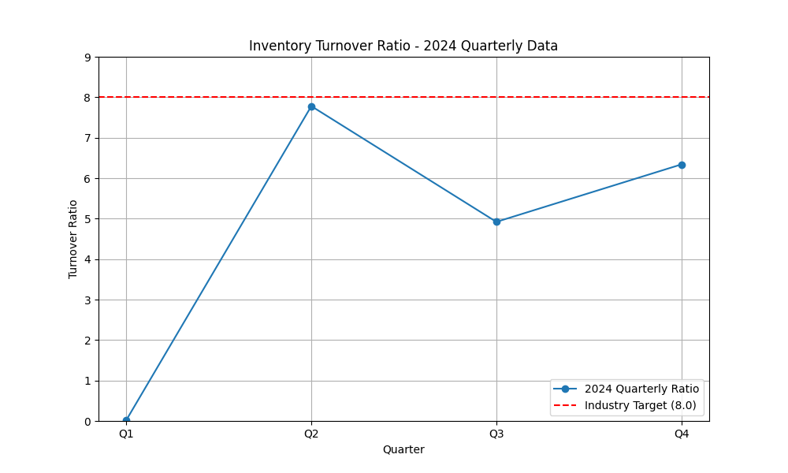

# Data Analysis of Inventory Turnover Ratio - 2024

This report provides an analysis of the Inventory Turnover Ratio for the year 2024, based on quarterly data. The analysis includes a visualization of the trend, a comparison against the industry benchmark, and actionable recommendations.

Contact Email: 23f1002830@ds.study.iitm.ac.in

## Data Visualization

Below is the trend of the Inventory Turnover Ratio for 2024, compared to the industry target.

## Key Findings

The average Inventory Turnover Ratio for 2024 is **4.76**, which is significantly below the industry target of **8**. The quarterly data shows high volatility, with a peak in Q2 (7.78) and a sharp drop in other quarters. This fluctuation indicates inconsistent inventory management practices.

- **Q1:** 0.02
- **Q2:** 7.78
- **Q3:** 4.92
- **Q4:** 6.34

The low average ratio suggests that inventory is not being converted into sales efficiently, leading to high holding costs and potential obsolescence.

## Business Implications

The current trend has several negative business implications:

- **Increased Holding Costs:** Excess inventory ties up capital and increases costs related to storage, insurance, and handling.
- **Risk of Obsolescence:** Products may become outdated or spoil, leading to write-offs.
- **Inefficient Capital Allocation:** Capital that could be used for growth opportunities is locked in inventory.
- **Poor Market Responsiveness:** High inventory levels can make it difficult to respond to changes in customer demand.

## Recommendations

To improve the Inventory Turnover Ratio and reach the target of 8, the following actions are recommended:

1.  **Optimize Supply Chain:** Implement a just-in-time (JIT) inventory system to reduce the amount of stock on hand.
2.  **Improve Demand Forecasting:** Utilize advanced analytics and machine learning to predict customer demand more accurately.
3.  **Enhance Sales and Marketing Efforts:** Launch targeted promotions to clear out slow-moving inventory.
4.  **Streamline Inventory Management:** Implement a robust inventory management system to track stock levels in real-time.

### **Solution:**

The core solution is to **optimize supply chain and demand forecasting**. By improving these two areas, the company can significantly reduce excess inventory and improve its turnover ratio.
