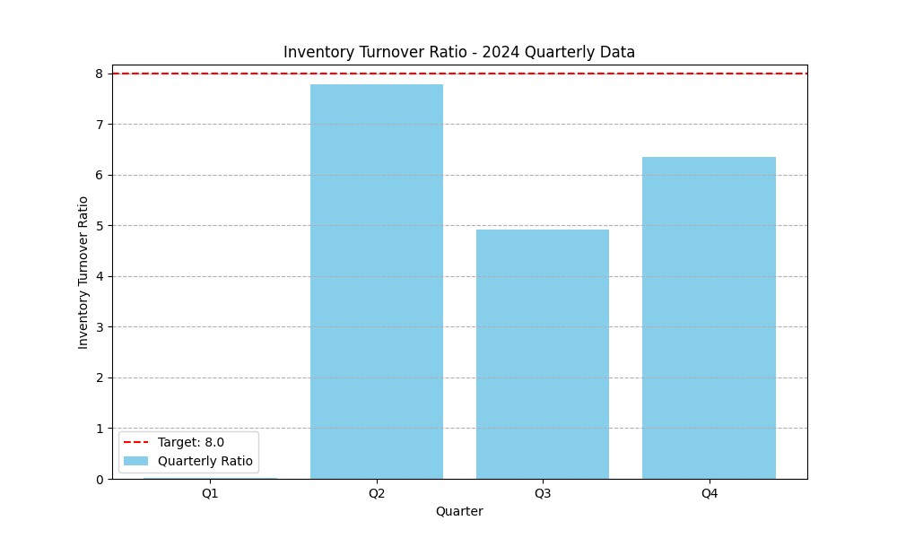

# Inventory Turnover Ratio Analysis - 2024

This report provides an analysis of the Inventory Turnover Ratio for the year 2024, based on quarterly data. The analysis was generated by Jules.

## Data Visualization

The following chart visualizes the quarterly Inventory Turnover Ratio against the industry target of 8.

## Key Findings

The average Inventory Turnover Ratio for 2024 is **4.76**, which is significantly below the industry target of 8.

- **Q1:** The ratio was extremely low at 0.02, indicating severe overstocking or issues with sales.
- **Q2:** A sharp recovery to 7.78, very close to the target, suggesting a major correction or a seasonal peak.
- **Q3 & Q4:** The ratio stabilized at 4.92 and 6.34, respectively. While showing improvement from Q1, these are still below the target.

The data indicates a highly volatile and inconsistent inventory performance throughout the year.

## Business Implications

The current average ratio of 4.76 suggests that a significant amount of capital is tied up in inventory, leading to increased holding costs (storage, insurance, obsolescence). This inefficiency can negatively impact cash flow and profitability. The volatility also suggests a disconnect between inventory management and actual market demand, leading to periods of overstocking and potential stockouts.

## Recommendations

To achieve the target Inventory Turnover Ratio of 8, the following actions are recommended:

**Optimize Supply Chain and Demand Forecasting:**

1.  **Enhance Demand Forecasting:** Implement more sophisticated demand forecasting models to better predict customer demand and reduce the need for excess safety stock.
2.  **Improve Supplier Collaboration:** Work more closely with suppliers to reduce lead times and implement a just-in-time (JIT) inventory system where possible.
3.  **Optimize Inventory Levels:** Use inventory management software to set optimal stock levels for each product category, avoiding both overstocking and stockouts.
4.  **Sales and Marketing Alignment:** Ensure that sales promotions and marketing campaigns are aligned with inventory planning to avoid sudden, unplanned spikes in demand.

By implementing these strategies, the company can improve its inventory efficiency, reduce costs, and move closer to the industry benchmark.

---

For any questions, please contact: 23f1002830@ds.study.iitm.ac.in
